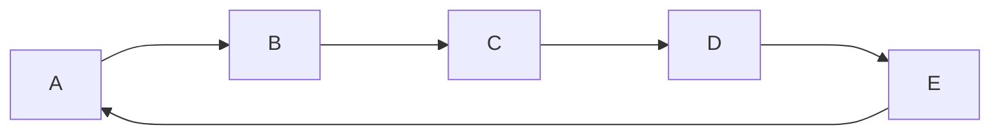
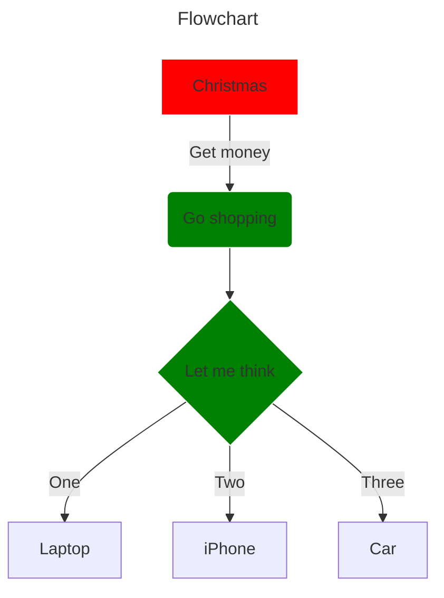
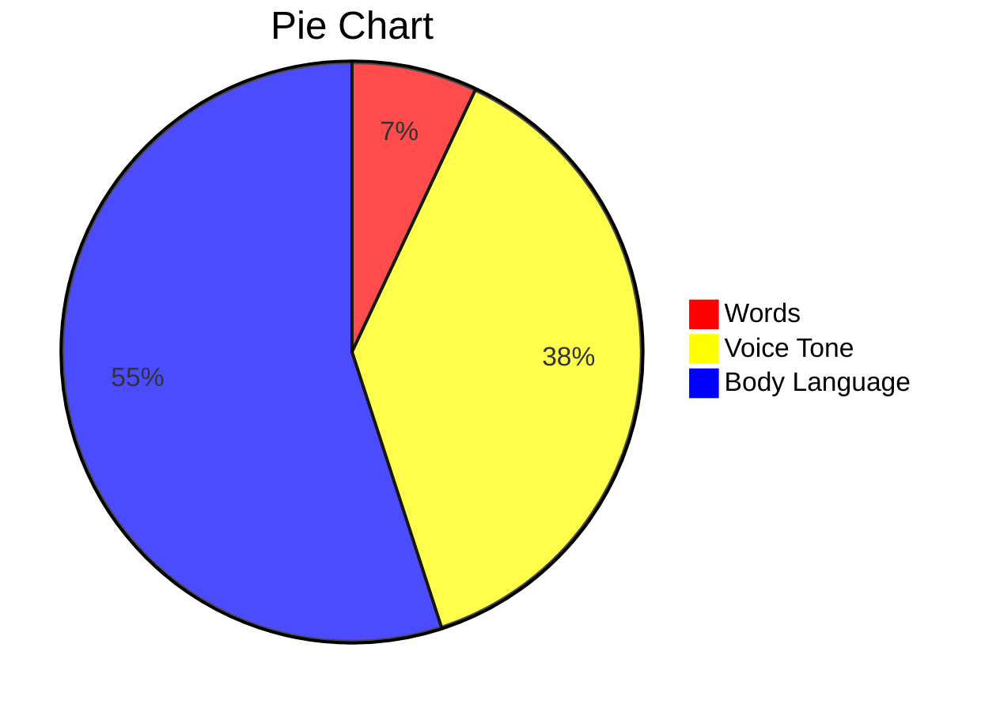
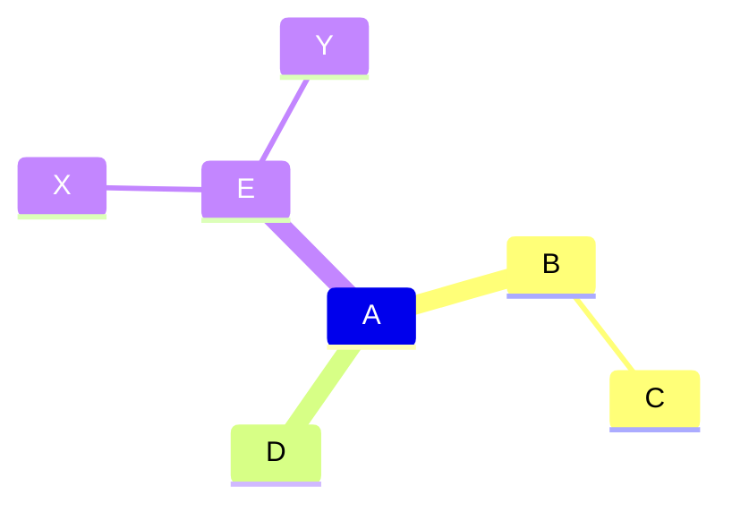
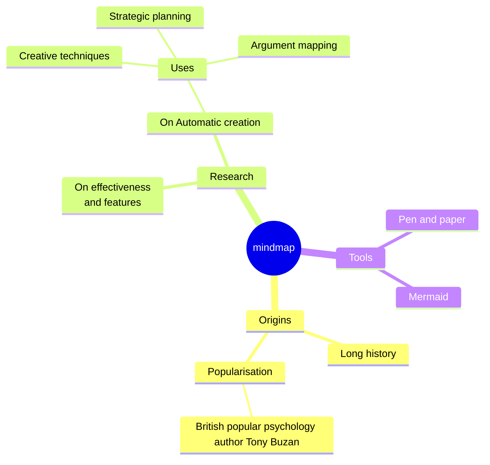
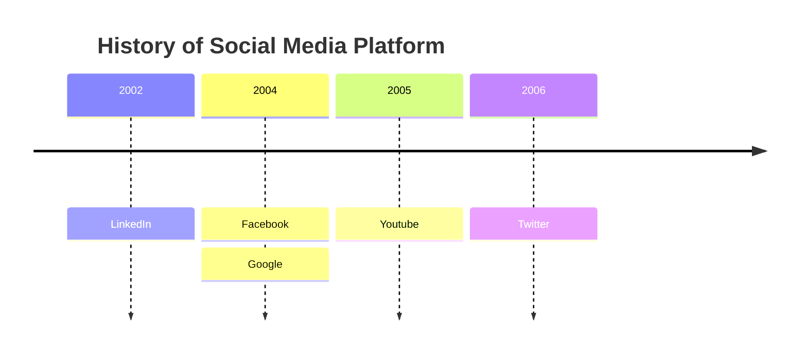
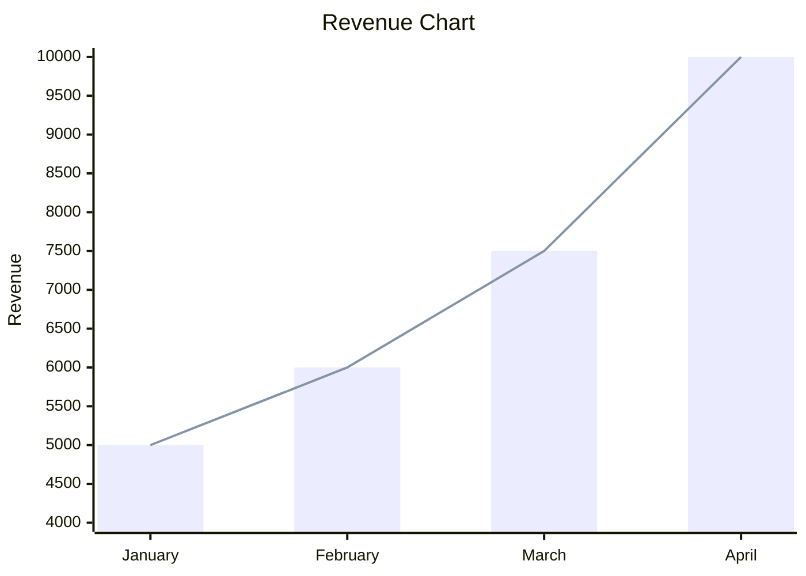

# mermaids

## FlowChart Left to Right




``` mermaid
flowchart LR
    WakeUp-- Brush Teeth -->B(EatBreakfast)
    EatBreakfast-->Go To College
    Exercise-->GoToWork
    GoToWork-->ReturnHome
```


## Flow Chart Top to Bottom





## Pie Chart





## Mindmap





## Mindmap





## Timeline




## XY Chart 



